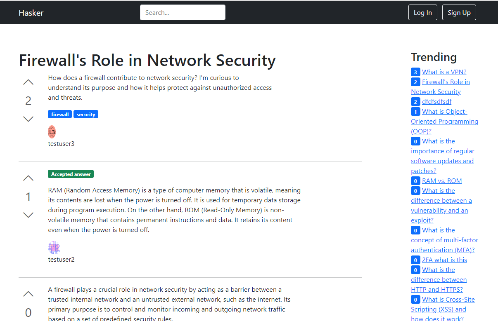

# Hasker: Poor Man's Stackoverflow
Q&A site as Django application.




## Build/Run instructions
### demo.env file
The repo comes with `demo.env` file. Use settings defined there or set your own before run.

###Run
The soluton is shipped in 3 Docker containers:
 * web (with django application)
 * db (postgres)
 * nginx (with nginx)

To spin them up, from the source root (where the docker-compose.yml file is located), run:
 * `docker compose up`

Then in your browser, open:
 * `http://localhost:8000/` 

### API
Entrypoint: `http://localhost:8000/api/v1/`

See `swagger` for the details: `http://localhost:8000/api/v1/swagger-ui`

Authentication:
* Basic + session. Any Django user will be authorized to get objects.
* ex.: `curl -X 'GET' 'http://localhost:8000/api/v1/questions/' -H 'accept: application/json' -u testuser1:PWDtU234%%`


Implements:
* GET only!
* Index of questions, with pagination, trending questions
* Index with search (in Q title, and Q and A messages):
  * `?search=<searchquery>`
* Retrieve specific question by id
* List answers to a specific question (by id)
* Q and A can be ordered for pagination by date of creation or number of votes:
  * `?ordering=date_created`
  * `?ordering=-date_created`
  * `?ordering=votes`
  * `?ordering=-votes`

### Fixtures
The repo comes with pre-populated database content for demo purposes. Thanks to `chatGPT` for providing necessary mockups for questions and answers! This content in form of fixtures is automatically (re)installed to the database on every run of the `web` docker container.

You may try to work under several pre-created demo users:
* `testuser1` / `PWDtU234%%`
* `testuser2` / `2PWDtU234%%`
* `testuser3` / `3PWDtU234%%`

## Run tests locally
Create hasker/settings/local.py with the contents:
```python
from .base import *

DATABASES = {
    'default': {
        'ENGINE': 'django.db.backends.sqlite3',
        'NAME': BASE_DIR / 'db.sqlite3',
    }
}
```
Run:
* `python manage.py test --settings hasker.settings.local`


## Dependencies and acknowledgments
1. Python (v3.10)
2. [Django](https://www.djangoproject.com/) (v4.1.7) A high-level Python web framework
3. [Django REST framework](https://www.django-rest-framework.org/) (v3.14.0) + [swagger](https://swagger.io/) 
5. [Bootstrap](https://getbootstrap.com/) (v5.0.2) - Front-end CSS framework
6. PostgreSQL (v15.3)
7. psycopg2 (v2.9.6)
8. Docker (v20.10.22)
9. Docker Compose (v2.15.1)
10. uWSGI (v2.0.21)
11. [ChatGPT](https://chat.openai.com/) (ChatGPT May 12 Version)

All dependencies are distributed under their respective licenses.
